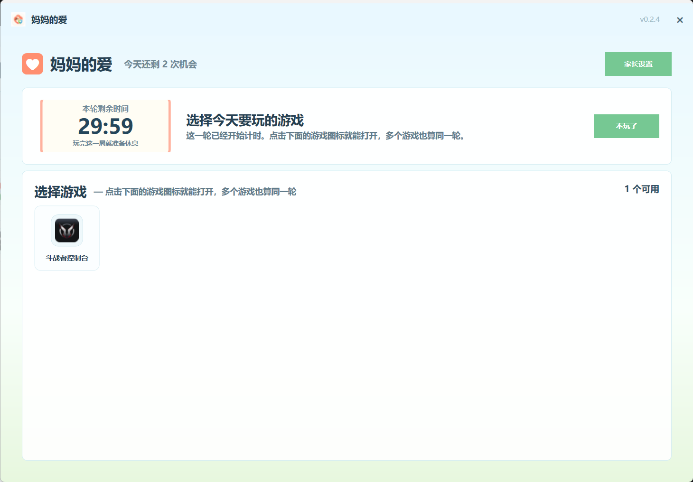
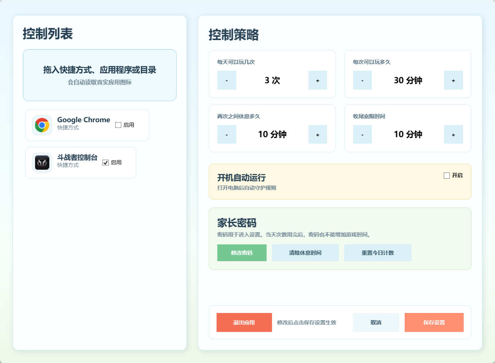

# 妈妈的爱

妈妈的爱是一款帮助家长温和管理孩子电脑使用时间的 Windows 应用。它不是简单粗暴地“禁止使用”，而是用清楚的规则、友好的提醒和固定的休息时间，帮助孩子逐步养成健康的屏幕使用习惯。

## 它适合解决什么问题？

很多家庭都会遇到类似情况：

- 孩子玩游戏或看电脑时，很难自己停下来。
- 家长每次都要反复提醒，容易变成争吵。
- 单纯锁电脑太生硬，孩子也不容易接受。
- 家长希望有一个固定规则，让孩子知道“什么时候可以玩、还能玩多久、什么时候必须休息”。

妈妈的爱希望把这些口头约定变成可见、可执行、可坚持的日常规则。

## 主要功能

### 每天可玩次数

家长可以设置孩子每天可以使用电脑或指定程序的次数。次数用完后，应用会进入“今日已用完”的状态，避免孩子反复请求继续使用。

### 单次使用时长

每次开始使用后，应用会显示本轮剩余时间。孩子可以清楚看到还剩多久，不需要家长一直在旁边提醒。

### 到点提醒和宽限时间

当本轮时间结束时，应用会弹出提醒。家长也可以设置一小段宽限时间，让孩子有机会保存进度、结束游戏或完成当前操作。

### 强制休息冷却

一次使用结束后，应用会进入冷却休息阶段。冷却结束前不能马上开始下一轮，帮助孩子从“连续玩很久”变成“玩一会儿、休息一会儿”。

### 家长密码保护

设置入口需要密码验证，避免孩子自行修改时间、次数或受控程序。

### 受控程序管理

家长可以添加需要管理的程序、快捷方式或文件夹，例如游戏启动器、学习机程序、浏览器或其他需要限制的应用。

### 托盘常驻

应用可以在后台常驻，家长不需要一直打开主窗口，也能持续执行规则。

## 应用场景

- 家里孩子每天只能玩几次游戏，每次固定时长。
- 放学后允许孩子休息娱乐，但需要避免连续沉迷。
- 周末可以适当放宽次数和时长，但仍需要中间休息。
- 家长不想每天反复催促，希望让电脑自动提醒和执行规则。
- 孩子需要一个清楚、可预期的倒计时界面，减少因为突然被打断产生的情绪。

## 界面截图

### 儿童主界面

### 使用中倒计时

### 时间到提醒

### 提醒弹窗

### 冷却休息界面

### 今日已用完

### 家长设置界面

### 密码输入界面

## 使用方式

1. 在 `Release` 页面下载压缩包。
2. 解压缩后，双击 `MomsLove.exe` 即可启动。
3. 首次启动时，如果系统提示需要安装 `.NET runtime`，请按提示下载安装。
4. 安装完成后，再次双击 `MomsLove.exe` 启动应用。

## 使用说明

1. 打开应用。
2. 家长进入设置页，设置每日次数、单次时长、冷却时间和宽限时间。
3. 添加需要管理的程序或游戏。
4. 给设置入口配置家长密码。
5. 孩子点击开始后，按照界面提示使用和休息。

## 设计理念

妈妈的爱强调“规则清楚、提醒温和、执行稳定”。它希望减少亲子之间围绕电脑使用时间的拉扯，让孩子知道规则不是临时变化的惩罚，而是每天都一样、可以提前预期的安排。
